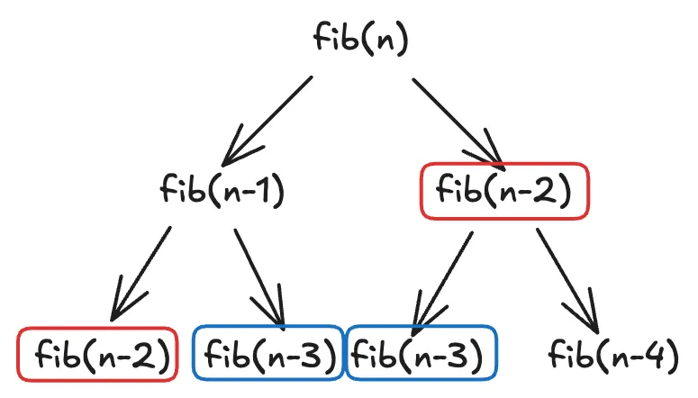
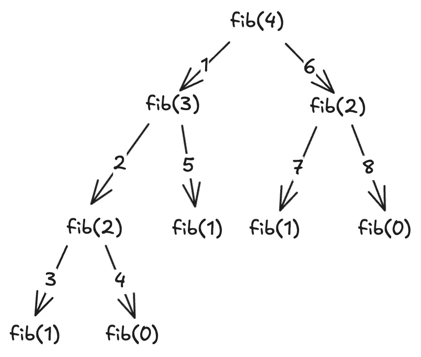

# dynamic programming - memorization (E)

tags: leetcode, python
Last updated time: 2025年10月2日 上午12:21
summary: Dynamic Programming 101 (❌) Learning memorization to accelerate your code

## **DP**

Dynamic programming (DP) is a method for solving complex problems by *breaking the original problem down into smaller, overlapping subproblems*.

Memoization is one of the techniques to implement DP. The core idea of memoization is: **store the results of function calls, and when the same inputs appear again, directly look up the stored results instead of recalculating**.

In practice, this is usually done with a mapping (a dict in Python) or another data structure as a cache to avoid redundant calculations and improve efficiency.

> You can imagine it like a calculator with memory. If you ask it 5 x 7, it will compute and store the result 35. The next time you ask the same input, the calculator will directly fetch 5 x 7 = 35 from memory instead of recalculating.
> 

---

## **Unoptimized Fibonacci**

As an example, let’s compute the Fibonacci sequence without memoization:

```python
def fib(n):
	if n <= 1:
		return n
	return fib(n-1) + fib(n-2)
```

If we visualize this approach, it looks like a tree:



figure1. fib visualization

Looking closely, we can see many repeated computations in this tree (highlighted in red and blue boxes).



figure2. fib(4) visualization

For instance, in fib(4), the function calls proceed as follows:

| **Step** | **1** | **2** | **3** | **4** | **5** | **6** | **7** | **8** |
| --- | --- | --- | --- | --- | --- | --- | --- | --- |
| Input | 3 | 2 | 1 | 0 | 1 | 2 | 1 | 0 |
| Repeated? |  |  |  |  | ✅(3) | ✅(2) | ✅(3) | ✅(4) |

We can see that at steps 5–8 (fib(1), fib(2), fib(1), fib(0)), these calculations had already been done earlier. This means the algorithm is **repeating the same computation many times**.

---

## **Optimized Fibonacci**

> If we record the results of already-computed calls, wouldn’t that save a lot of work? (Yes!)
> 

A more efficient solution is to use a mapping (dictionary in Python) to store computed results:

```python
def mfib(n, memo={}):
	if n in memo:
		return memo[n]
	if n <= 1:
		return n
	memo[n] = mfib(n-1, memo) + mfib(n-2, memo)
	return memo[n]
```

In the same example (fib(4)), the repeated calculations (steps 5–8) are avoided because when reaching if n in memo:, we can just return the stored result instead of recalculating.

---

## **Complexity Analysis**

You might wonder: *How much time does memoization actually save?*

- **Unoptimized Fibonacci**:
    
    The recursion tree has height n (to reach the base case, you need n levels). For fib(4), the recursion tree has 9 nodes, approximately 2^4. In general, the total number of nodes is 2^n, so the time complexity is **O(2^n)**.
    
- **Optimized Fibonacci (with memoization)**:
    
    We only compute when the input hasn’t been stored yet. In total, we calculate fib(n-1), fib(n-2), …, fib(1) — about n-1 calls. So the time complexity is **O(n)**.
    
- **Space complexity consideration**:
    
    Taking fib(4) as an example, recursion depth is n. The maximum stack depth is n, so the space complexity is **O(n)**.
    

Thus, memoization reduces time complexity dramatically, from exponential to linear.

---

## **Script for Comparison**

Here’s a small script to count how many times each approach calculates fib(n-1) + fib(n-2):

```python
cnt = 0
mcnt = 0
def fib(n):
    global cnt
    if n <= 1:
        return n
    cnt += 1
    return fib(n-1) + fib(n-2)

def mfib(n, memo={}):
    global mcnt
    if n in memo:
        return memo[n]
    if n <= 1:
        return n
    mcnt += 1
    memo[n] = mfib(n-1, memo) + mfib(n-2, memo)
    return memo[n]

fib(1 << 5)
mfib(1 << 5)
print(f"fib function calculated f(n-1) + f(n-2) {cnt} times")
print(f"mfib function calculated f(n-1) + f(n-2) {mcnt} times")
```

### **Output:**

```bash
fib function calculated f(n-1) + f(n-2) 3524577 times
mfib function calculated f(n-1) + f(n-2) 31 times
```

---

Memoization reduces **3,524,577 recursive calculations** down to only **31 calculations** — a huge improvement.

---