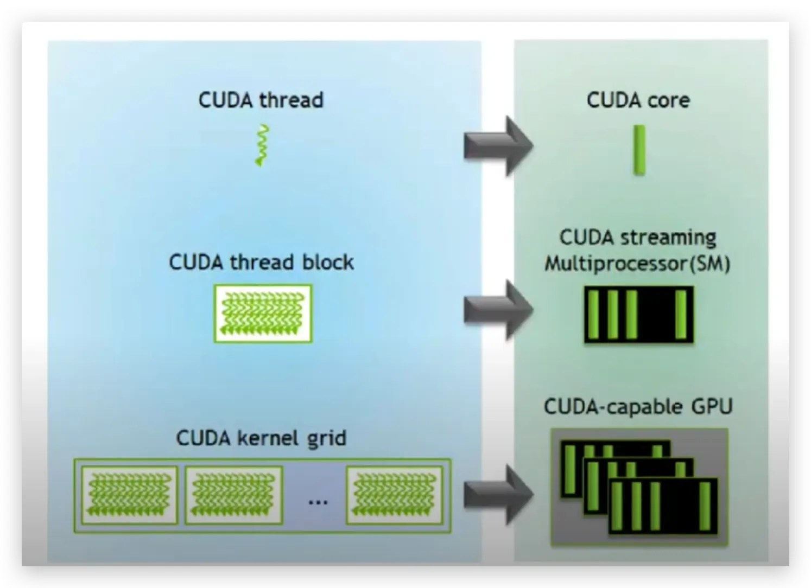
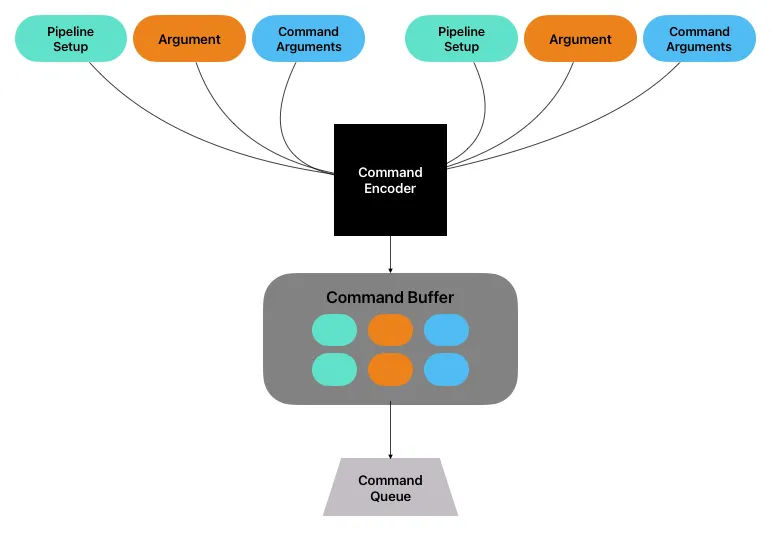

# Target of this note

The target of this note is to have a overview introduction for those who does not have experience in `metal`. This will not only includes the concepts of how `metal` works but also the introduction of what the framework.

## Overview

For those who don’t know what is the difference between CPU and GPU, it would be better to read this [article](https://www.kodeco.com/books/metal-by-tutorials/v4.0/chapters/3-the-rendering-pipeline) first.

[Metal](https://developer.apple.com/metal/) is the API that apple use to accelerate their GPU. Just like **cuda, metal** is also using the structure of **SIMT (Single Instruction Multiple Threads)** model.This model reflects the fundamental but important concept in GPU — parallelism. When a GPU function (kernel) is executed, thousands to millions of psuedo-independent instances (called **threads**) of the kernel are executed parallelly.



### Metal Shading Language (MSL)

This is the Objective-C language that `metal` provides to call the API to run the kernels or to mange the resources between CPU and GPU.

## Threads

In Metal, the hierarchy of threads is:

1. **Thread**: the single execution unit of the kernel
    - The position of thread can be accessed using
        1. `[[thread_position_in_threadgroup]]`
        2. `[[thread_position_in_grid]]`
2. **Threadgroup**: A collection of threads that shares a common block & synchronization.
    - The **threads in the same threadgroup share a common block of memory**.
    - The position of threadgroup can be access using `[[threadgroup_position_in_grid]]`
3. **SIMD group/ Warp**: thread in threadgroups are organized in SIMD (single-instruction, multiple-data) groups.
    - The threads in a SIMD group execute the same code.
4. **Grid**: A collections of threadgroups.
    - grid can be 1D, 2D (dealing with image), 3D

](img/threads.png)

The maximum of the threads can be used in threadgroup is related to the hardware (use `device.max_threads_per_threadgroup` to check).

- `[[thread_position_in_grid]]` == `thread_position_in_grid * threads_per_threadgroup + thread_position_in threadgroup`

All in all, we can simply conclude that: *The basic unit in metal is a **thread**. Multiple threads consists of a **thread group (warp/block in** `cuda`**)**. Several thread groups makes a **grid**.*

---

### How many threads can I use in a thread group?

According to [this](https://stackoverflow.com/questions/50093793/metal-compute-shaders-threadgroup-threadexecutionwidth), you can have `512` or `1024` threads in a thread group depends on the device you use.

> The GPU hardware is split up into several SIMD groups. If threadExecutionWidth is 32 and the maxThreadsPerThreadgroup is 512, that means there are 512/32=16 of these SIMD groups in the hardware and each of these SIMD groups can run 32 threads at a time. The GPU will decide which group of 32 threads to schedule in which SIMD group -- as a developer you have no control over this. Actual hardware details are unpublished by Apple, so exactly how the GPU works is mostly guesswork.
> 

Or using `device.max_threads_per_threadgroup` to get the max threads of your device.

### Does threadgroup in MSL run sequentially?

No, it always run in parallel. ([reference](https://stackoverflow.com/questions/55679004/execution-order-of-metal-thread-groups))

---

### Equivalence of `threads` between cuda and metal shader

| **CUDA** | **Metal Shading Language** |
| --- | --- |
| threadIdx | thread_position_in_threadgroup |
| blockIdx | threadgroup_position_in_grid |
| blockDim | threads_per_threadgroup |
| gridDim | ? |
| ? | thread_position_in_grid |
| ? | simdgroup_index_in_threadgroup |
| ? | thread_index_in_simdgroup |
| warpSize | simdgroup_size() |
| __syncthreads | threadgroup_barrier() |
| cudaDeviceSynchronize() | command_buffer.wait_util_completed() |

---

## Components needed to execute `metal` kernels

### Device

Metal device is a abstraction of your GPU machine in code. Different Apple machine have different limitation and features based due to the difference of the hardware. You can see the [Metal Feature Set Tables](https://developer.apple.com/metal/Metal-Feature-Set-Tables.pdf) to check out the machine you’re using.

### Buffer

**Buffers** act as the bridge between CPU and GPU. It is a block of memory that can be shared between CPU and GPU. It’s used to store data that the shader will process or that will hold the results of the computation.

### Pipeline State

The compute pipeline state defines how your kernel (computing shader) will be executed. This is usually related to the **kernel name. →** The pipeline state is **basically all the code written in Metal Shader Language (MSL), which provides all the necessary steps/ commands/ instructions for the GPU to execute.**

> The commands is just like the instructions in CPU, which specifies what the GPU should do.
> 

### Command Encoder

A **command encoder** is used to encode GPU commands into a command buffer. After the **pipeline state and arguments (buffers)** are set up (i.e., we chose a pipeline state and allocate buffers for input and output), a command buffer would take all of them, create a package that will be executed on the GPU. These packages are sent into **command buffer.**

### Command Buffer

> creation / storage of computational kernel packages ( commands + arguments)
> 

The packages encoded by command encoder is sent into c**ommand buffer.** These buffers stores the functions/computations that we want to execute.

### Command Queue

> Execution of kernels (FIFO)
> 

Those packages stored in command buffer will be push into **command queue**. The reason why it is called queue is that the executing order is FIFO.



## A simple example

if we have two $n$-length arrays, $A$ and $B$, and we want to compute the addition of each element of the 2 arrays, and store the result in an array $C$, where the code be like:

```objectivec
int main() {
    constexpr size_t SIZE = 10000;
    uint a[SIZE] = {1, 2, 3,..., 9999, 10000};
    uint b[SIZE] = {2, 4, 6,..., 19998, 20000};
    uint c[SIZE];

		for (int i = 0; i < 10000; i++) {
			c[i] = a[i] + b[i];
		}
}

```

To parallelize this, we can write the kernel:

```objectivec
kernel void two_array_addition(
    constant uint* input_a [[buffer(0)]],
    constant uint* input_b [[buffer(1)]],
    device uint* output_c [[buffer(2)]],
    uint idx [[thread_position_in_grid]]
) {
    output_c[idx] = input_a[idx] + input_b[idx];
}

```

### Executing kernel from rust

This repo is a template that integrates `metal-rs` and building script, enable us to execute kernels on metal shader through rust code.

**Compile**

To execute the kernel, we have to compile the metal shaders into `.metallib` file, which is the binary of the code. This process is completed in the cargo building process (see [two-array-addition/build.rs](https://github.com/FoodChain1028/metal-playground/blob/main/two-array-addition/build.rs)). Therefore, by running `cargo build`, the `shaders.metallib` will be generated in the build folder.

**Executing Kernel**

This is an example of how kernel is called from rust wrapper.

```rust
fn execute_kernel(name: &str, input_a: &[u32], input_b: &[u32], output_c: &[u32]) -> Vec<u32> {
    assert!(input_a.len() == input_b.len() && input_a.len() == output_c.len());

    let len = input_a.len() as u64;

    // 1. Init the MetalState
    let state = MetalState::new(None).unwrap();

    // 2. Set up Pipeline State
    let pipeline = state.setup_pipeline(name).unwrap();

    // 3. Allocate the buffers for A, B, and C
    let buffer_a = state.alloc_buffer_data::<u32>(input_a);
    let buffer_b = state.alloc_buffer_data::<u32>(input_b);
    let buffer_c = state.alloc_buffer_data::<u32>(output_c);

    let mut result: Vec<u32> = vec![];

    autoreleasepool(|| {
        // 4. Create the command buffer & command encoder
        let (command_buffer, command_encoder) = state.setup_command(
            &pipeline,
            Some(&[(0, &buffer_a), (1, &buffer_b), (2, &buffer_c)]),
        );

        // 5. command encoder dispatch the threadgroup size and num of threads per threadgroup
        let threadgroup_size = MTLSize::new(len, 1, 1);
        let num_threads_per_threadgroup = MTLSize::new(1, 1, 1);

        command_encoder.dispatch_threads(threadgroup_size, num_threads_per_threadgroup);

        command_encoder.end_encoding();

        command_buffer.commit();
        command_buffer.wait_until_completed();

        // 6. Copy the result back to the host
        result = MetalState::retrieve_contents::<u32>(&buffer_c);
    });

    result
}

```

By calling this function, we are able to call a kernel in rust:

```rust
fn main() {
    const SIZE: u32 = 1 << 26;
    // input_a = [1, 2, 3, ..., 2^{30}]
    // input_b = [2, 4, 6, ..., 2 * 2^{30}]
    let input_a = (1..SIZE).collect::<Vec<u32>>();
    let input_b = input_a.clone().iter().map(|x| x * 2).collect::<Vec<u32>>();

    let output_c = vec![0; (SIZE - 1) as usize];
    let expected_output = (1..SIZE).map(|x| x + x * 2).collect::<Vec<u32>>();

    let result = execute_kernel("two_array_addition", &input_a, &input_b, &output_c);
    let result_alias = execute_kernel("two_array_addition_alias", &input_a, &input_b, &output_c);

    assert_eq!(result, expected_output);
    assert_eq!(result_alias, expected_output);
}

```

## What is shared memory?

The shared memory in GPU is a fast, on-chip memory that can be accessed by all threads within a  threadgroup. This is equivalent to shared memory in CUDA and local memory in OpenCL.

In MSL, it is using address space: `threadgroup`
e.g.,

```objectivec
kernel void foo_kernel(threadgroup int* arr[[ threadgroup(0) ]]) {
	//...
}

```

In `metal-rs` / Rust side we need to set it into the command_buffer:

```objectivec
let shared_memory_bytes = 4 * 100; // array: u32[100]
command_encoder.set_threadgroup_memory_length(0, shared_memory_bytes);

```

## Reducing Shader Bottlenecks

https://developer.apple.com/documentation/xcode/reducing-shader-bottlenecks

kernel launching takes time (but we need to verify this, I will ask the forum in Apple developer)

- Metal Shader compiles “just-in-time”, this might cause hundreds of milliseconds to compile: [link](https://www.reddit.com/r/GraphicsProgramming/comments/1g588j8/apple_metal_shader_compilation_time/)

## Great resources

### Documents

- [Metal Feature Set Table](https://developer.apple.com/metal/Metal-Feature-Set-Tables.pdf): to see what your device have (i.e., limitations) for metal.
- [Performing Calculations on a GPU](https://developer.apple.com/documentation/metal/performing_calculations_on_a_gpu?language=objc): a simple introduction to MSL.
- [visualized threads & threadgroup](https://developer.apple.com/documentation/metal/compute_passes/creating_threads_and_threadgroups?language=objc)

### Optimization

- [Advanced Metal Shader Optimization](https://developer.apple.com/videos/play/wwdc2016/606/)

### Articles

- [Using Metal and Rust to make FFT even faster](https://blog.lambdaclass.com/using-metal-and-rust-to-make-fft-even-faster/)

### Debugging

- [MSL debugger reference](https://stackoverflow.com/questions/35985353/metal-shading-language-console-output)
- [When is a `simdgroup_barrier()` required](https://forums.developer.apple.com/forums/thread/743710) (versus `threadgroup_barrier`)
- [Barrier](https://developer.apple.com/documentation/dispatch/dispatch_barrier/)

### Github

- [Obj-C MPS (Metal Performance Shader) implementation](https://github.com/ivarflakstad/mps-rs/tree/main)
- [metal-benchmarks](https://github.com/philipturner/metal-benchmarks)
- [GPGPU-comparison cheat sheet](https://github.com/xmartlabs/gpgpu-comparison)

### Something similar but in CUDA

- [Intro to CUDA](https://www.youtube.com/watch?v=4APkMJdiudU&list=PLC6u37oFvF40BAm7gwVP7uDdzmW83yHPe): a basic video introducing what and how to develop on GPU
- [CUDA programming](https://www.youtube.com/watch?v=xwbD6fL5qC8)
- [Cuda from scratch](https://blog.lambdaclass.com/cuda-from-scratch/)
- [cuda-c++-programming](https://docs.nvidia.com/cuda/cuda-c-programming-guide/index.html)