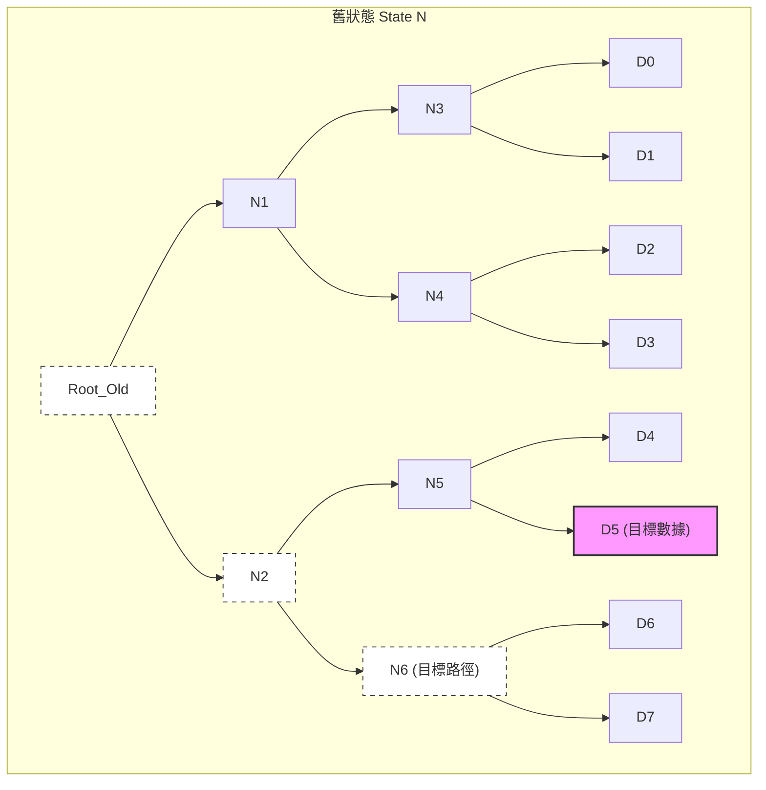
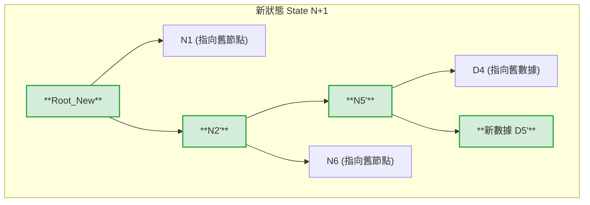

# To begin with

Recently I am contributing to lodestar, a typescript & zig ethereum consensus client, and I encountered many new concepts and data structure that I never saw before. So I think it's a great opportunity to compile what I learned during the contributions here.

# TreeView

# TreeView 解釋

沒問題。用圖解來說明「結構共享（Structural Sharing）」是理解 Backing Tree 最快的方式。

我們想像一個擁有 8 個數據的列表（List），底層是一個 3 層的二元樹（）。

目標操作：**`List[5] = "新數據"`**

---

### 圖解說明

#### 圖例：

* `[ ]` 方框：代表樹的節點（Node），裡面存的是哈希值 (Hash)。
* `D0`~`D7`：代表實際的底層數據（葉子節點）。
* **粗體部分**：代表為了這次修改而新創建的節點。
* `-->` 虛線箭頭：代表新節點指向舊節點的引用（這就是「共享」）。

---

### 狀態一：修改前 (初始狀態)

假設我們有一個列表，目前的根節點哈希是 `Root_Old`。我們要修改索引為 5 的數據 (`D5`)。

*(圖中粉紅色 D5 是我們要改的目標，虛線框是受影響的路徑)*

---

### 狀態二：執行 `List[5] = "新數據"` 之後

系統**不會**去修改上面的 `Root_Old` 這棵樹。
相反，它會創建一條全新的路徑，並盡可能「掛載」到舊的樹上。

---

### 詳細步驟解析 (跟著圖看)

當你執行 `list[5] = update` 時，Backing Tree 在底層做了這四件事：

1. **創建新葉子：**
系統首先為新的數據創建一個新的葉子節點 `[**新數據 D5'**]`。
2. **複製並更新父節點 (Path Copying)：**
系統需要更新 `D5` 的父節點 `N5`。它**不會**修改舊的 `N5`，而是創建一個新的節點 `[**N5'**]`。
* 這個新 `[**N5'**]` 的右邊指向新的 `D5'`。
* **關鍵點：** 這個新 `[**N5'**]` 的左邊，直接指向舊樹中已存在的 `D4`（因為 D4 沒變）。

3. **向上遞歸：**
接著更新 `N5` 的父節點 `N2`。系統創建新的 `[**N2'**]`。
* 它的左邊指向剛剛創建的 `[**N5'**]`。
* 它的右邊直接指向舊樹中的 `N6`（因為 N6 底下的 D6, D7 都沒變）。

4. **生成新根：**
最後，創建新的根節點 `[**Root_New**]`。
* 它的右邊指向新的 `[**N2'**]`。
* 它的左邊直接指向舊樹整整半邊的 `N1`。

### 總結這個圖的意義

* **什麼變了？** 只有綠色粗體框起來的那條路徑上的節點是新創建的。
* **什麼沒變？** 圖中標示「(指向舊節點)」的部分。在這個例子中，8 個數據我們只改了 1 個，但我們**重用了舊樹中約 70% 的結構**（N1 整顆子樹, N6 整顆子樹, 以及 D4）。
* **效率：** 無論這棵樹有多寬（例如有 100 萬個數據），修改一個數據只需要創建樹高度（Log N）數量的新節點。這就是為什麼它在處理大數據時非常高效的原因。

